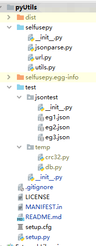

Self-Use Python Lib
=

[](https://pypi.org/project/selfusepy/)
[](http://www.apache.org/licenses/LICENSE-2.0)

### DirTree



### Json To Object

#### Usage
more info in [json_test_cases]
```python
import selfusepy
obj: One = selfusepy.parse_json(jsoStr, One())
```

#### Notice
    Because Python is not a strongly-typed language, so you must
    assign a value when you define a variable in class, 
    otherwise the parse can not get the right type of each variable, 
    just like examples below 
#### e.g. 1

Python Class
```python
from selfusepy.jsonparse import BaseJsonObject
class One(BaseJsonObject):

  def __init__(self):
    self.x: str = '' #  have to be assigned
    self.two: One.Two = One.Two()

  class Two(BaseJsonObject):
    def __init__(self):
      self.y: str = ''
      self.three: One.Two.Three = One.Two.Three()

    class Three(BaseJsonObject):
      def __init__(self):
        self.z: str = ''
```
Json str
```json
{
  "x": "x",
  "two": {
    "y": "y",
    "three": {
      "z": "z"
    }
  }
}
```

#### e.g. 2

Python Class
```python
from selfusepy.jsonparse import BaseJsonObject
from typing import List
class One1(BaseJsonObject):

  def __init__(self):
    self.x: str = ''
    self.two: List[One1.Two] = [One1.Two()]

  class Two(BaseJsonObject):
    def __init__(self):
      self.y: str = ''
```
Json str
```json
{
  "x": "x",
  "two": [
    {
      "y": "y1"
    },
    {
      "y": "y2"
    }
  ]
}
```

[json_test_cases]:test/jsontest/__init__.py
